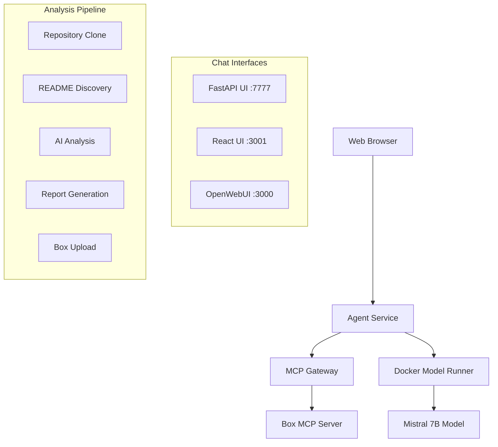

# 📊 README Analyzer Agent

A complete Docker Compose system that analyzes README files from the [compose-for-agents](https://github.com/docker/compose-for-agents) repository and uploads comprehensive analysis reports to Box using MCP (Model Context Protocol).

## 🎯 Features

✅ **One-command startup**: `docker compose up`  
✅ **Multiple chat interfaces**: FastAPI UI, React UI, and OpenWebUI  
✅ **AI-powered analysis**: Uses Mistral 7B via Docker Model Runner  
✅ **Comprehensive reports**: Individual and comparative analysis  
✅ **Box integration**: Automatic upload via MCP Gateway  
✅ **Real-time progress**: Live updates during analysis  

## 🚀 Quick Start

### Prerequisites
- Docker Desktop with Model Runner enabled
- Box MCP server configured (included with Docker Desktop)
- At least 8GB RAM (for Mistral 7B model)

### 1. Start the System
```bash
docker compose up
```

### 2. Access Interfaces
| Interface | URL | Description |
|-----------|-----|-------------|
| **Main Agent** | http://localhost:7777 | Built-in FastAPI chat interface |
| **React UI** | http://localhost:3001 | Alternative React-based UI |
| **OpenWebUI** | http://localhost:3000 | Full-featured chat interface |

### 3. Run Analysis
1. Open any interface
2. Type `analyze readme` or click "🔍 Analyze READMEs"
3. Watch the progress as it:
   - 📥 Clones compose-for-agents repository
   - 🔍 Finds all README files
   - 🧠 Analyzes each with AI
   - 📊 Creates comparative insights
   - 📤 Uploads to Box

## 🏗️ Architecture



## 📋 Usage

### Chat Commands
- `analyze readme` - Start full README analysis
- `status` - Check system status  
- `help` - Show available commands

### Analysis Process
1. **Repository Sync**: Clones/updates compose-for-agents repo
2. **File Discovery**: Scans for all README.md files
3. **Individual Analysis**: AI analyzes each README for:
   - Project overview and purpose
   - Key technologies and architecture
   - Setup instructions and requirements
   - Notable features and patterns
4. **Comparative Analysis**: Cross-project insights including:
   - Common architectural patterns
   - Technology trends
   - Best practices
   - Use case diversity
5. **Report Generation**: Creates comprehensive markdown report
6. **Box Upload**: Saves timestamped report to Box

## 📊 Sample Output

The generated report includes:

```markdown
# 📊 Compose-for-Agents README Analysis Report

**Generated:** 2025-09-10 14:30:25  
**Total Files Analyzed:** 8  
**Repository:** docker/compose-for-agents

## 1. agno/README.md
**Path:** `agno/README.md`  
**Size:** 2,341 characters  

### Analysis:
[Detailed AI analysis of the Agno project...]

## 2. github-summarizer/README.md
[Additional project analyses...]

# 🔍 Comparative Analysis

## Common Patterns
- Most projects use FastAPI for web services
- Docker Compose with multi-service architectures
- MCP integration for external tool access

## Technology Trends
[AI-generated insights about technology usage...]
```

## ⚙️ Configuration

### Model Settings
```yaml
models:
  mistral-small:
    model: ai/mistral:7B-Q4_0  # ~4.1 GB
    context_size: 8192         # Adjust based on VRAM
```

### Environment Variables
- `MODEL_RUNNER_URL`: Docker Model Runner endpoint
- `MODEL_RUNNER_MODEL`: Model identifier  
- `MCPGATEWAY_URL`: MCP Gateway connection
- `AGENT_PORT`: Main agent port (default: 7777)

## 🛠️ Development

### File Structure
```
readme-analyzer-agent/
├── compose.yaml              # Main orchestration
├── agent/
│   ├── main.py              # Core agent logic
│   ├── Dockerfile           # Agent container
│   └── requirements.txt     # Python dependencies
├── ui/
│   ├── src/                 # React components
│   ├── Dockerfile           # UI container
│   └── package.json         # Node dependencies
├── .env                     # Environment config
└── README.md               # This file
```

### Customization
- **Change Model**: Edit `models.mistral-small.model` in compose.yaml
- **Adjust Memory**: Modify `context_size` for your hardware
- **Add Analysis**: Update prompts in `agent/main.py`
- **UI Styling**: Customize CSS in React components

## 🔧 Troubleshooting

| Issue | Solution |
|-------|----------|
| Model Runner not found | Enable Docker Model Runner in Docker Desktop |
| Box upload fails | Verify Box MCP server is configured |
| Out of memory | Reduce `context_size` in compose.yaml |
| Port conflicts | Change port mappings in compose.yaml |
| Analysis errors | Check logs with `docker compose logs readme-analyzer` |

### Logs
```bash
# View all logs
docker compose logs

# Follow specific service
docker compose logs -f readme-analyzer

# Check health
docker compose ps
```

## 📈 Performance

- **Analysis Time**: ~2-5 minutes for 8 README files
- **Model Loading**: ~30 seconds initial startup
- **Memory Usage**: ~6-8GB for Mistral 7B
- **Storage**: ~5GB for model + containers

## 🤝 Contributing

1. Fork the repository
2. Create a feature branch
3. Make your changes
4. Test with `docker compose up --build`
5. Submit a pull request

## 📄 License

MIT License - Feel free to use and modify for your projects.

---

**Ready to analyze some README files?** 🎯

Run `docker compose up` and visit http://localhost:7777 to get started!
